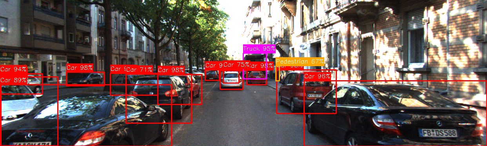

# Fed_DiffusionDet

Federated Learning implementation of diffusion-based object detection. It's built over [DiffusionDet](https://github.com/ShoufaChen/DiffusionDet) and with a benchmark [Ultranalytic's](https://github.com/ultralytics) YOLO for object detection on KITTI datasets.

This project contains centralized baselines and two federated learning implementations using the **Flower (flwr) framework**. Each federated implementation is a separate Flower app created with `flwr new`. Please watch [these tutorials](https://youtube.com/playlist?list=PLNG4feLHqCWkdlSrEL2xbCtGa6QBxlUZb&si=C525duifNr7FjhZe) for more clarity on Flower app.


*Sample object detection result on KITTI dataset*

## Repository Structure

- **`centralized/`** - Centralized DiffusionDet and YOLO baselines
- **`fl_yolo/`** - Federated YOLO (Flower app)
- **`fl_diffusiondet/`** - Federated DiffusionDet (Flower app)
```

## Quick Start

### Prerequisites
- Python 3.11
- CUDA 12.1.1
- PyTorch 2.1.2
- Flower (flwr) 1.19.0
```

### Environment Setup
```bash
# Clone the repository
git clone https://github.com/berhanekiross/Fed_DiffusionDet.git
cd Fed_DiffusionDet

# Install Flower
```bash
pip install -U flwr
```

## Federated Learning Apps

### 1. FL-YOLO

**Installation:**
```bash
cd fl_yolo
pip install -e .
```

**Run Federated Training:**
```bash
flwr run . local-simulation-gpu
```

### 2. FL-DiffusionDet
Federated DiffusionDet implementation using custom aggregation strategies.

**Installation:**
```bash
cd fl_diffusiondet
pip install -e .
```

**Run Federated Training:**
```bash
flwr run . local-simulation-gpu
```

**Configuration:**
- FL strategies: `app_modules/strategies.py`
- Model config: `configs/diffdet_config.yaml`
- Dataset: COCO-format annotations in `fl_dataset/annotations/`

## Centralized Baselines

### DiffusionDet on KITTI
```bash
cd centralized
python train_net.py --config configs/diffdet.kitti.res50.yaml
```

### YOLO on KITTI
```bash
cd centralized
yolo detect train \
    model=yolov8n.pt \
    data=configs/kitti_yolo.yaml \
    epochs=100 \
    patience=30 \
    batch=64 \
    imgsz=640 \
    workers=16 \
    device=0 \
```

## Dataset Setup
DiffusionDet requires COCO-style dataset setup and YOLO requieres the YOLO format.

## 📝 Citation

If you use this code, please cite:
```bibtex
@mastersthesis{Gebremeskel2025,
  author = {Gebremeskel, Berhane Kiross},
  title = {Federated Diffusion Models for Vehicular Applications},
  school = {Uppsala University},
  year = {2025},
  type = {Master's Thesis},
  url = {https://urn.kb.se/resolve?urn=urn:nbn:se:uu:diva-572714}
}
```
